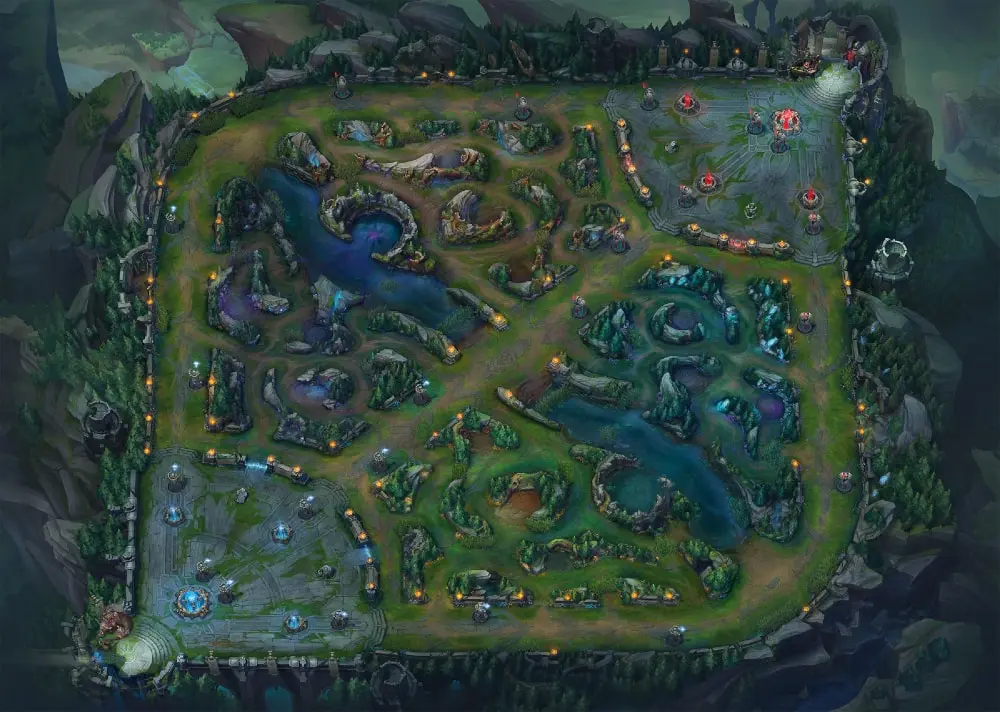
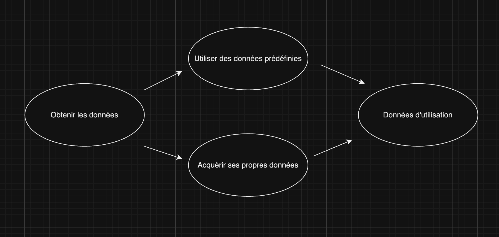

# Projet : League of Legends game prediction

## Introduction

Ce projet se base sur un jeu très célèbre, League of Legends. Ce jeu a été créé le 27 octobre 2009 par Riot Games. Il s'agit d'un MOBA (Multiplayer Online Battle Arena), un jeu vidéo en ligne multijoueur. Deux équipes de cinq joueurs (équipe rouge et équipe bleu) s'affrontent, l'objectif principal étant de détruire la base adverse en utilisant différent stratégies.

Le jeu contient un peu plus de 150 champions qui peuvent être joué. Il existe 5 catégories de champions : slayer, mage, fighter, controller, tank and marksman.

Lorsque vous êtes en jeu, chaque joueur devront se diriger sur une "lane", qui veut dire voie. Il existe 3 lanes (top, mid et bot) et jungle.

Généralement, la voie du top sont réservé pour les fighter. La voie du mid pour les slayers et mages. La voie du bot pour les marksman et controller/tank.

### La carte du jeu

## Objectif du projet

L'objectif principal de ce projet sera de prédire l'issue d'un match en fonction des valeurs du jeu à la 15e minute.

## Acquisition de données

Pour ce projet, j'ai deux options pour acquérir des données.

Choisir l'option "Utiliser des données pré-définies" va nous permettre de gagner beaucoup de temps car les données seront déjà traitées et nettoyées. De plus, League of legends est un jeu qui subit énorménement de gros changements chaque début d'année (nouvelles fonctionnalités, nouveaux monstres dans la faille de l'invocateur, ajout des nouveaux items, etc.) et des petits changements qu'on appelle des patches. Les patchs sont des petites mises à jour qui se produisent dans un intervalle de 2 mois environ. Le but des patchs sont de buff et/ou nerf les champions, items, etc. Enfin, les données pré-définies seront pas modifiable, on restera bloqué sur les saisons des années passées (donc les mises à jour antérieur). 

Dans mon cas, je vais plutôt partir sur "aquérir ses propres données". Je pourrai notamment prendre connaissance directement des données que j'aurais récolté sur différentes sites, au lieu de prendre les dataset déjà pré-définies sur kaggle.

Avec quelques recherche, j'ai pu trouver des sites qui me permettront d'obtenir les données que je souhaite pour ce projet. Voici les sites ci-dessous :

Le site [Leaguepedia](https://lol.fandom.com/wiki/League_of_Legends_Esports_Wiki) nous donnerons des informations sur la League-Pro de LoL de chaque région (EUROPE, ASIE, AMÉRIQUE DU NORD, etc.). On aura les informations suivantes:

- Informations sur les équipes
- Profil des joueurs
- Tournois
- Historique des matchs
- Méta compétitive
- Statistiques globales
- Informations sur le jeu et l'esport
- Actualités et mises à jour

Le site [Riot Games](https://developer.riotgames.com/apis) offre un API avec différents endpoints qu'on peut utiliser gratuitement. Il suffit de se crée un compte riot. De plus, Riot Games nous met à disposition la [documentation](https://riot-api-libraries.readthedocs.io/en/latest/collectingdata.html) sur le collecte de donnée.