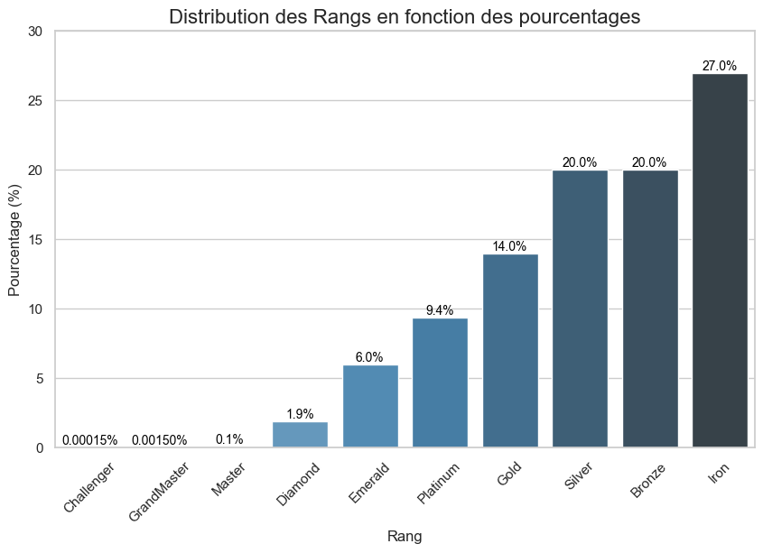

# Projet : League of Legends game prediction

## Introduction

Ce projet se base sur un jeu très célèbre, League of Legends. Ce jeu a été créé le 27 octobre 2009 par Riot Games. Il s'agit d'un MOBA (Multiplayer Online Battle Arena), un jeu vidéo en ligne multijoueur. Deux équipes de cinq joueurs (équipe rouge et équipe bleu) s'affrontent, l'objectif principal étant de détruire la base adverse en utilisant différent stratégies.

Le jeu contient un peu plus de 150 champions qui peuvent être joué. Il existe 5 catégories de champions : slayer, mage, fighter, controller, tank and marksman.

Lorsque vous êtes en jeu, chaque joueur devront se diriger sur une "lane", qui veut dire voie. Il existe 3 lanes (top, mid et bot) et jungle.

Généralement, la voie du top sont réservé pour les fighter. La voie du mid pour les slayers et mages. La voie du bot pour les marksman et controller/tank.

### La carte du jeu


## Objectif du projet

L'objectif principal de ce projet sera de prédire l'issue d'un match en fonction des valeurs du jeu à la 15e minute.

## Acquisition de données

Pour ce projet, j'ai deux options pour acquérir des données.


Choisir l'option "Utiliser des données pré-définies" va nous permettre de gagner beaucoup de temps car les données seront déjà traitées et nettoyées. De plus, League of legends est un jeu qui subit énorménement de gros changements chaque début d'année (nouvelles fonctionnalités, nouveaux monstres dans la faille de l'invocateur, ajout des nouveaux items, etc.) et des petits changements qu'on appelle des patches. Les patchs sont des petites mises à jour qui se produisent dans un intervalle de 2 mois environ. Le but des patchs sont de buff et/ou nerf les champions, items, etc. Enfin, les données pré-définies seront pas modifiable, on restera bloqué sur les saisons des années passées (donc les mises à jour antérieur). 

Dans mon cas, je vais plutôt partir sur "aquérir ses propres données". Je pourrai notamment prendre connaissance directement des données que j'aurais récolté sur différentes sites, au lieu de prendre les dataset déjà pré-définies sur kaggle.

Avec quelques recherche, j'ai pu trouver des sites qui me permettront d'obtenir les données que je souhaite pour ce projet. Voici les sites ci-dessous :

Le site [Leaguepedia](https://lol.fandom.com/wiki/League_of_Legends_Esports_Wiki) nous donnerons des informations sur la League-Pro de LoL de chaque région (EUROPE, ASIE, AMÉRIQUE DU NORD, etc.). On aura les informations suivantes:

- Informations sur les équipes
- Profil des joueurs
- Tournois
- Historique des matchs
- Méta compétitive
- Statistiques globales
- Informations sur le jeu et l'esport
- Actualités et mises à jour

Le site [Riot Games](https://developer.riotgames.com/apis) offre un API avec différents endpoints qu'on peut utiliser gratuitement. Il suffit de se crée un compte riot. De plus, Riot Games nous met à disposition la [documentation](https://riot-api-libraries.readthedocs.io/en/latest/collectingdata.html) sur le collecte de donnée.

Après avoir crée notre compte riot, on devra générer un API key dans la partie espace personnel pour qu'on puisse enfin réaliser des requêtes.

À quoi correspond une requête ? Une requête est une demande unique à l'API, que ce soit pour :

- Récupérer les détails d'un seul match.
- Obtenir la liste d'IDs de matches pour un joueur.
- Consulter les informations de base sur un joueur (GET /lol/summoner/v4/summoners/by-name/{summonerName}).

Nous allons tout d'abord se concentrer sur le [ACCOUNT-V1](https://developer.riotgames.com/apis), plus précisément sur l'endpoint **/riot/account/v1/accounts/by-riot-id/{gameName}/{tagLine}** (Get account by riot id). Cette endpoint nous permettra d'obtenir un PUUID (Player Universally Unique Identifier), c'est un identifiant unique et universel attribué à chaque joueur de Riot Games. Il suffit tout simplement d'entrer la région et le nom du joueur. (tagLine : EUW1 (EUROPE) | gameName : Hide on bush).

### Exemple de réponse

```
{
    'puuid': 'IQI3rmA2gADOiwM8k-W1PArp5weKeMlvb2tvVm90d9H46wssfzUg41yugo0xHaMNnzT7mRcBdZOtOw',
    'gameName': '110011000',
    'tagLine': 'EUW'
}
```

Après obtention du PUUID d'un joueur, nous pourrons obtenir la liste des matches qui ont été jouées par ce joueur. Tout cela se déroulera dans la partie [MATCH-V5](https://developer.riotgames.com/apis#match-v5), plus précisément sur l'endpoint **/lol/match/v5/matches/by-puuid/{puuid}/ids** (Get a list of match ids by puuid). En lui donnant le PUUID et si on le souhaite, donner quelques information supplémentaire (startTime, endTime, queue, type, etc.) pour filtrer plus précisément les parties qu'on recherche. Après avoir exécuté cette requête, nous allons recevoir une réponse sous forme de liste et cette liste contiendra un ensemble d'IDs des matches historique.

### Exemple de réponse

```
['EUW1_7190251636', 'EUW1_7190200489', 'EUW1_7189712542', 'EUW1_7189666927', 'EUW1_7188989524', 'EUW1_6935697613', 'EUW1_6867213169', 'EUW1_6867170534', 'EUW1_6739352762', 'EUW1_6620040608', 'EUW1_6619995521', 'EUW1_6619919736', 'EUW1_6618915653', 'EUW1_6618834724', 'EUW1_6611388498', 'EUW1_6611318612', 'EUW1_6611260350', 'EUW1_6606466582', 'EUW1_6606394171', 'EUW1_6606327223']
```

On peut désormer avoir toutes les informations concernant une partie à l'aide de la liste qu'on a obtenue précédemment. Nous sommes toujours dans la partie MATCH-V5. Rendons-nous sur l'endpoint **/lol/match/v5/matches/{matchId}** (Get a match by match id), puis on lui donne l'ID d'un match, par exemple 'EUW1_7190251636' en précisant la RÉGION.

### Exemple de réponse

```
{
    "metadata": {
        "matchId": "EUW1_XXXXXXXXXX",
        "participants": [PUUID1, PUUID2, ...]
    },
    "info": {
        "gameInformation": "X1"
        "participants": [
            {
                Player1

                "summonerName": "X2",
                "summonerID": X3
                "KDA": "K/D/A",
                "totalDamage": X4,
                "spellCasts": X5,
                "totalMinionsKilled": X6,
                "wardPlaced": X7,
                "win": False | True
            },
            {
                Player2
                ...
            },
            {
                Player3
                ...
            },
            
            ...

            {
                Player10
                ...
            }
        ]
    },
    "tournamentCode": ""
}
```

Malheureuseument, Riot Games a limité les requêtes API à:

- 20 requêtes toutes les 1 seconds(s)
- 100 requêtes toutes les 2 minutes(s)

L'API Riot Games impose ces limites pour éviter les abus, appelées **rate limits**.

Il existe d'autres endpoints mais nous allons pas l'utiliser dans ce projet.

Voici tout ce qui est à savoir sur l'API de Riot Games et Leaguepedia.

### Quantité de données à récuperer pour ce projet

L'idéal est de récuperer 100 000 parties. Malheureuseument, ça risque d'être compliqué dans le sens ou on a le droit à 100 requêtes toutes les 2 minutes et notre API reste actif seulement 24h.

Dans l'idée, une requête nous permet de récuperer 1 partie. Si on fait le calcule, on est à environ 3000 requêtes/heure, ça revient à 72 000 parties qu'on peut récuperer, soit 72 000 requêtes en 24h.

Les 72k parties que nous allons récuperer ne sera pas récuperé de façon au hasard. Dans League of Legends, il existe ce qu'on appelle "ELO". L'ELO determine les skills d'un joueur. Plus l'ELO d'un joueur est élevé, plus il est consideré bon/fort sur le jeu.

Nous allons réaliser une distribution des ELO afin d'obtenir la répartition des parties que nous prévoyons de récupérer.

### Web Scrapping

Le but de cette partie sera de réaliser une distribution des ELO de League of Legends. Nous utiliserons le site [League of Graph](https://www.leagueofgraphs.com/) pour réaliser cette tâche. Le but sera d'utiliser la méthode du Web Scrapping pour récuperer les données qu'on veut à l'aide du package python **BeautifulSoup**. Le principe du Web Scrapping est de parser la page HTML du site, localiser les données dont on a besoin et de les stockers dans une base de donnée ou un fichier csv.

Le notebook du web scrapping sera dans le dossier **notebook/web_scrapping/web_scrapping.ipynb**.

La première étape était de récuperer les données que nous avons besoin. Après réalisation de cette première étape, on stock les données brute obtenue dans le dossier **data/raw/elo_distribution_data.csv**.

La deuxième étape est de faire du preprocessing des données. Le but étant de nettoyer les données, supprimer et/ou ajouter des valeurs manquantes etc. Les données nettoyées sont stocké dans le dossier **data/processed/clear_elo_distribution_data.csv**.

### Graphe de la distribution des rangs

Le graphe de la distribution des rangs en 2025 pour toutes régions confondu (EUW, NA, KR, etc.).



On remarque que les personnes très haut elo sont très peu (seulement 2% des joueurs sont classé plus haut que Emerald). On voit aussi que la majorité des joueurs sont classé inférieur à Platine. La repartition des parties vont se baser sur cette distribution.

### Tableau

(Afficher le tableau des proportions des matches selon les élos)
Calculer les proportions de games qu'on va prendre, faire des maths ext....
Taff
Je taff